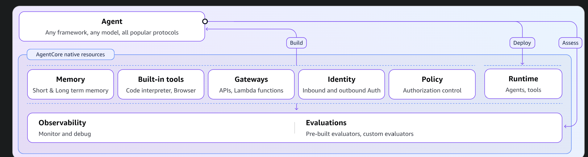

# Weather Agent -- AgentCore Production Deployment

**From prototype to production using Amazon Bedrock AgentCore.**
Based on: "Architecting AI Systems: Scaling with Bedrock AgentCore and Designing at Speed"



---

## Why AgentCore? (Project 1 vs Project 3)

If you already built the weather agent in `1_BuildingwithAgenticAl`, you might be thinking:
**"My agent already works. I call the Bedrock API, it calls the NWS API, I get a forecast. Why do I need AgentCore?"**

That is a fair question. The short answer: **Project 1 is a prototype. Project 3 is the production version of that same prototype.**

Here is what that means in practice.

### What Project 1 actually does

In Project 1, your `weather_agent.py` runs entirely on YOUR laptop:

```
Your Laptop
  |
  +-- weather_agent.py (Python script)
        |
        +-- boto3.client('bedrock-runtime')  --> calls Bedrock API directly
        +-- subprocess.run(['curl', ...])     --> calls NWS API via curl
        +-- input() loop                      --> waits for you to type
```

This works perfectly for learning and experimentation. But consider these questions:

1. **What if 100 users need to use your agent at the same time?**
   Your laptop runs one copy. You would need to manually spin up 100 servers.

2. **Who is allowed to call your agent?**
   Anyone with access to your laptop. There is no authentication, no authorization,
   no way to say "only my app can call this."

3. **What happens when a request fails at 3 AM?**
   You would never know. There are no logs, no alerts, no traces. The error
   just disappears.

4. **Can your agent remember what a user asked 5 minutes ago?**
   No. Every run of `python weather_agent.py` starts fresh. There is no session
   memory, no conversation history.

5. **How do you update the agent without downtime?**
   Kill the process, change the code, restart. If anyone was using it, they
   get disconnected.

### What AgentCore gives you

AgentCore wraps your exact same agent logic in production infrastructure:

```
Internet
  |
  +-- HTTPS endpoint (secure, authenticated)
        |
        +-- AgentCore Runtime (serverless, auto-scaling)
              |
              +-- microVM #1: weather_agent_runtime.py (User A's session)
              +-- microVM #2: weather_agent_runtime.py (User B's session)
              +-- microVM #3: weather_agent_runtime.py (User C's session)
              |       ... up to 2,000 concurrent sessions
              |
              +-- AgentCore Identity   --> controls WHO can call the agent
              +-- AgentCore Memory     --> remembers past conversations
              +-- AgentCore Gateway    --> manages tool access securely
              +-- CloudWatch           --> logs every step for debugging
```

### The real difference: a side-by-side comparison

| Concern | Project 1 (Direct API) | Project 3 (AgentCore) |
|---|---|---|
| **Where does it run?** | Your laptop only | AWS serverless infrastructure |
| **How many users?** | 1 (you, in the terminal) | Up to 2,000 concurrent sessions |
| **Authentication** | None -- anyone can run the script | IAM or OAuth -- only authorized callers |
| **Session memory** | None -- every run starts fresh | Short-term + long-term memory across sessions |
| **Monitoring** | Print statements to your terminal | Full CloudWatch logs, traces, and metrics |
| **Scaling** | Manual (run more copies yourself) | Automatic (0 to 2,000 sessions, scales to zero when idle) |
| **Deployment** | `python weather_agent.py` on your machine | `agentcore launch` deploys to a secure HTTPS endpoint |
| **Isolation** | Everything shares your OS process | Each session runs in its own isolated microVM |
| **Session duration** | Until you press Ctrl+C | Up to 8 hours per session (longest in the industry) |
| **Cost when idle** | Your laptop stays on | Scales to zero -- you pay nothing when nobody is using it |
| **Code changes needed** | N/A (baseline) | 3 lines: import SDK, create app, add `@app.entrypoint` |

### The key insight

The agent logic is the same. Both projects call Bedrock, both call the NWS API,
both return a weather forecast. The difference is everything AROUND the agent:

- Project 1 = **the agent brain** (smart, but sitting on your desk)
- Project 3 = **the agent brain + a body** (deployed, secured, monitored, and scaled)

Think of it like writing a web app. You can build a Flask app that runs on
`localhost:5000` -- it works, but nobody else can use it. To make it available
to users, you deploy it to a server with a domain name, HTTPS, load balancing,
and logging. That is exactly what AgentCore does for AI agents.

### "But I can just deploy my script to EC2 myself"

You could. But then you would need to handle:

- Containerization (Dockerfile, ECR)
- Load balancing and auto-scaling
- IAM roles and security groups
- Session management and isolation
- Memory/state persistence
- Logging and tracing infrastructure
- Health checks and restart policies
- HTTPS certificate management

AgentCore handles ALL of this with a single `agentcore launch` command. The
`@app.entrypoint` decorator and `BedrockAgentCoreApp()` wrapper are the only
code changes needed -- 3 lines total.

---

## Architecture overview

```
[User] --> [AgentCore Runtime] --> [Strands Agent + http_request tool]
                |                         |
                |                         +--> NWS Points API
                |                         +--> NWS Forecast API
                |
                +--> [AgentCore Identity]  (inbound: who can call the agent)
                +--> [AgentCore Memory]    (short-term + long-term)
                +--> [AgentCore Gateway]   (tool proxy, semantic search)
                +--> [CloudWatch]          (observability, traces)
```

---

## Prerequisites

- AWS CLI configured (`aws sts get-caller-identity` works)
- Python 3.10+
- Docker installed (for local testing only -- cloud deploy uses CodeBuild)

---

## Step-by-step deployment

### Step 1: Install the AgentCore starter toolkit

```bash
# Create project directory
mkdir agentcore-weather && cd agentcore-weather

# Create virtual environment
python -m venv .venv
source .venv/bin/activate    # Mac/Linux
# OR: .venv\Scripts\activate  # Windows

# Install dependencies
pip install bedrock-agentcore bedrock-agentcore-starter-toolkit strands-agents strands-agents-tools pyyaml
```

> **What just happened:** You installed the AgentCore SDK and CLI toolkit.
> The toolkit provides `agentcore` commands for configure, launch, invoke, and status.

---

### Step 2: Configure the agent for deployment

```bash
agentcore configure -e weather_agent_runtime.py --region us-east-1
```

When prompted:
- **Memory:** Choose "both short-term and long-term" (enables STM + LTM)
- Accept defaults for everything else

> **What just happened:** The toolkit created a hidden `.bedrock_agentcore.yaml` file
> with your deployment configuration. This tells AgentCore how to package and deploy
> your agent. Memory is automatically provisioned based on your choice.

---

### Step 3: Test locally (optional but recommended)

```bash
# Start local dev server
agentcore launch --dev
```

In another terminal:
```bash
# Test with curl
curl -X POST http://localhost:8080/invocations \
  -H "Content-Type: application/json" \
  -d '{"prompt": "What is the weather in Seattle?"}'
```

> **What just happened:** Your agent is running locally as an HTTP service on port 8080.
> This is the same interface AgentCore Runtime uses in production -- if it works here,
> it will work in the cloud.

---

### Step 4: Deploy to AgentCore Runtime

```bash
agentcore launch
```

This automatically:
1. Generates a Dockerfile
2. Builds an ARM64 container image (via AWS CodeBuild)
3. Pushes image to Amazon ECR
4. Creates an AgentCore Runtime
5. Deploys and provides a secure HTTPS endpoint

Wait for status: **READY**

> **What just happened:** Your local Python script is now running as a serverless agent
> on AWS infrastructure. It can scale from 0 to 2,000 concurrent sessions, each in its
> own isolated microVM. Sessions can run up to 8 hours (longest in the industry).

**Note the ARN from the output** -- you need it to invoke the agent.

---

### Step 5: Invoke the deployed agent

```bash
# Using the CLI
agentcore invoke '{"prompt": "What is the weather in Miami?"}'

# Or using the Python script
python invoke_agent.py "What is the weather in New York?"
```

> **What just happened:** You called your agent via a secure HTTPS endpoint.
> The request went through AgentCore Runtime, which provisioned an isolated microVM,
> ran your agent code, and returned the response. All logged and observable.

---

### Step 6: Check observability

```bash
agentcore status
```

Or go to the AWS Console:
1. **Bedrock** > **AgentCore** > your agent > see status, versions, endpoints
2. **CloudWatch** > **Logs** > look for AgentCore logs
3. **CloudWatch** > **Transaction Search** > see step-by-step agent reasoning traces

> **What just happened:** AgentCore Observability gives you the same "Show Trace"
> experience you had in the Bedrock console, but for your code-based agent.
> You can see every reasoning step, tool call, and response.

---

## Video topics covered

| Video topic | Time | Implementation |
|---|---|---|
| 4 production challenges (performance, scaling, security, governance) | [11:54] | AgentCore Runtime solves all 4 |
| AgentCore Runtime (serverless, 8hr sessions, microVM isolation) | [27:13] | weather_agent_runtime.py + agentcore launch |
| Deploying a Strands agent to Runtime (5 steps) | [30:26] | Steps 1-4 above |
| @app.entrypoint decorator | [34:06] | weather_agent_runtime.py line 126 |
| Auto Dockerfile + ECR + deploy | [28:47] | agentcore launch handles this |
| Status READY + HTTPS endpoint | [36:12] | agentcore status |
| Identity (inbound/outbound auth) | [41:24] | Auto-configured by toolkit |
| Gateway (unified tool proxy) | [50:42] | Auto-configured with --enable-gateway |
| Memory (short-term + long-term) | [58:37] | Configured during agentcore configure |
| Semantic search (reduce context window) | [01:00:12] | Gateway feature when tools > 10 |
| 8-hour session limit | [38:52] | AgentCore Runtime default |
| Scaling 0 to 2,000 sessions | [27:13] | Automatic with Runtime |

---

## Project files

| File | Purpose |
|---|---|
| weather_agent_runtime.py | Main agent wrapped for AgentCore Runtime |
| config.yaml | Model configuration (same as CLI version) |
| requirements.txt | Python dependencies |
| invoke_agent.py | Script to call the deployed agent |

---

## Cleanup

To avoid charges, delete the agent when done:

```bash
# Delete via CLI
agentcore destroy

# Or via console
# Bedrock > AgentCore > select your agent > Delete
```

---

## What changed from the CLI version

| CLI version (weather_agent_cli.py) | Runtime version (weather_agent_runtime.py) |
|---|---|
| Uses raw boto3 + subprocess curl | Uses Strands Agent + http_request tool |
| Runs on your laptop only | Runs on AgentCore Runtime (serverless) |
| No auth, no scaling, no monitoring | Identity + auto-scaling + CloudWatch |
| Manual input loop | HTTP service with JSON API |
| config.yaml for model switching | Same config.yaml works |
| 3 Bedrock API calls per query | Same, but logged and traced automatically |